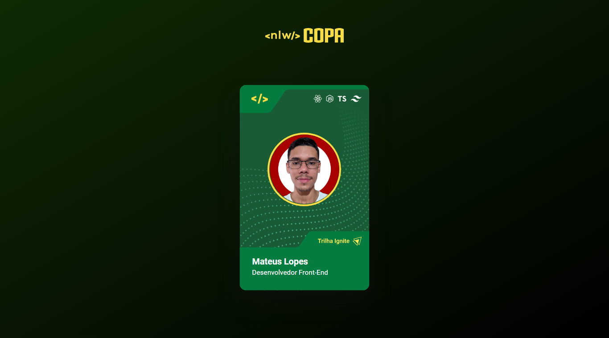
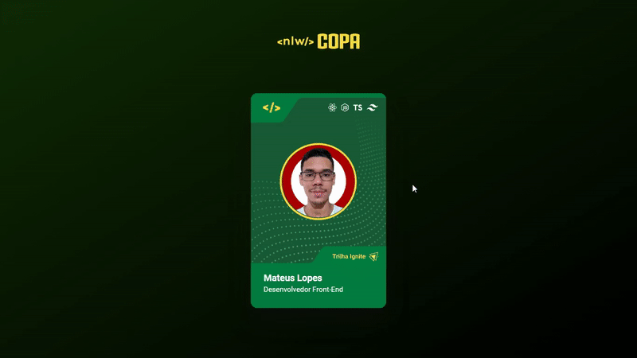

  

<h1 align="center">
    Card Copa
</h1>

<h3 align="center">
  Um card temático animado da copa do mundo no Catar 2022
</h3>

    <a href="#🔗-clique-aqui-para-vizualizar-a-página!">Demonstração</a>&nbsp;&nbsp;&nbsp;|&nbsp;&nbsp;&nbsp;
    <a href="#🔨-tecnologias-usadas">Tecnologias usadas</a>&nbsp;&nbsp;&nbsp;|&nbsp;&nbsp;&nbsp;
    <a href="#🎯-features">Features</a>&nbsp;&nbsp;&nbsp;|&nbsp;&nbsp;&nbsp;
    <a href="#📝-licença">Licença</a>

### [🔗 Clique aqui para vizualizar a página!](https://mateuss18.github.io/Copa-card/)

  

## 🎬 Video de demonstração

  

>
---

## 🔨 Tecnologias usadas

###

>
---
## 🎯 Features

- Reponsividade
- Acessibilidade
- Animações

---

## 📝 Licença   

Esse projeto está sob a licença MIT. Veja o arquivo [LICENSE](LICENSE) para mais detalhes.

---

Feito por Mateus Lopes :D ❤   

